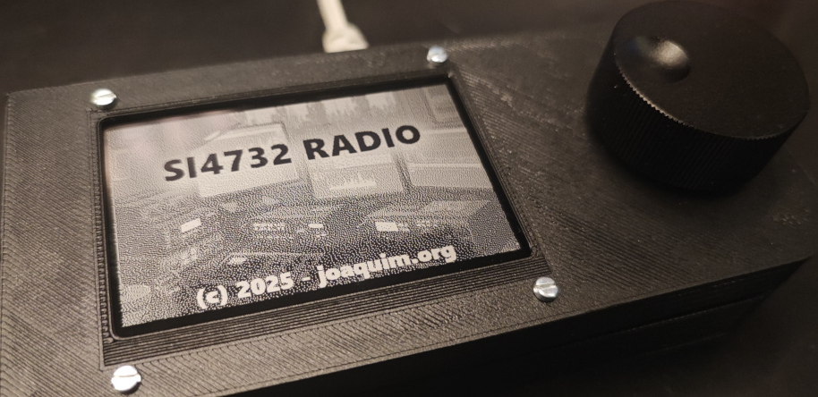
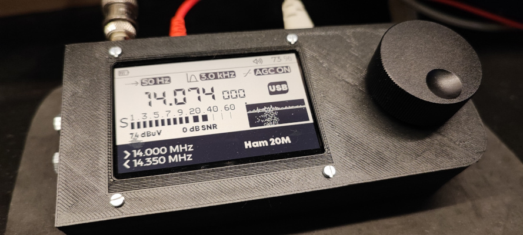
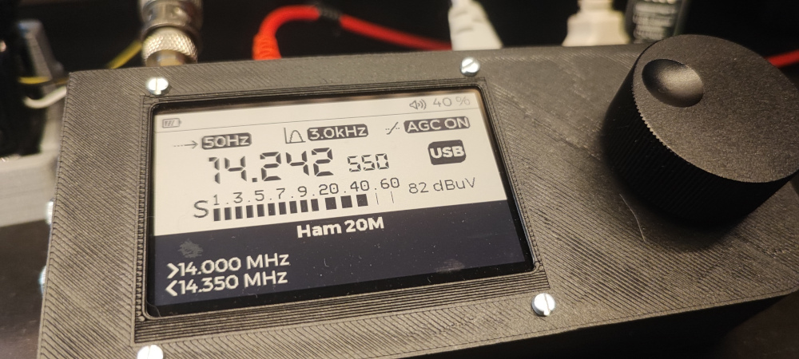
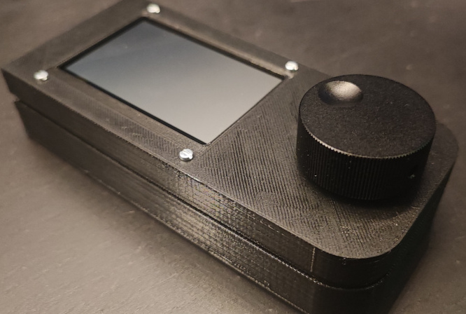
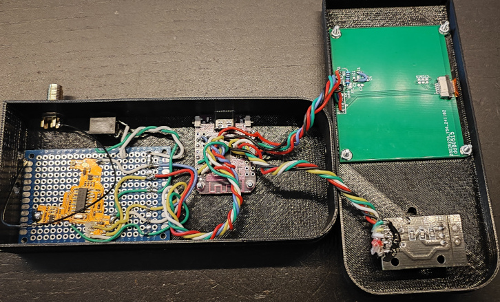
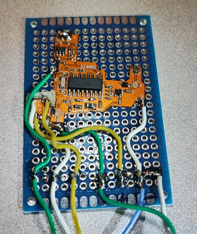
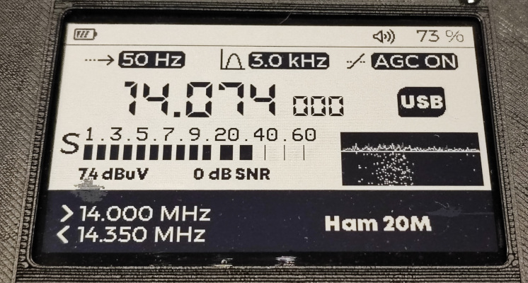
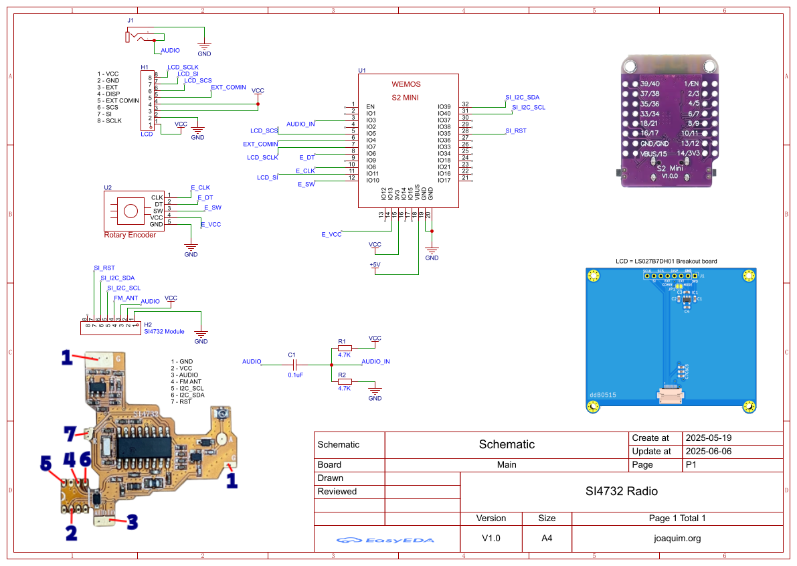

# SI4732 Radio

SI4732 Radio is a custom firmware project designed to power my home-built radio receiver.

Based on [G8PTN's ATS_MINI](https://github.com/G8PTN/ATS_MINI).

## Overview

It harnesses the capabilities of the SI4732 module to deliver high-quality FM radio performance, while the innovative design optimizes simple hardware into a complete and versatile receiver platform.

[](https://www.youtube.com/watch?v=iMb66FNOmYM)
[](https://www.youtube.com/watch?v=ZbDGKxzLqTs)

## Features

- FM (with RDS), LW, MW and SW up to 30 MHz in AM, LSB, USB and CW (SSB patch).
- Large frequency display with the Hz digits in SSB/CW, S-meter, SNR and an audio spectrum/waterfall.
- **Band ruler** at the bottom of the screen: band edges, the IARU Region 1 band plan segments (CW solid, digital checkered, SSB empty), a marker for every preset frequency and a cursor on the tuned frequency. The middle of the ruler names what is being received: the preset name and its mode (e.g. `FT8 [USB]`, `VOLMET Shannon [USB]`), or else the band and the band plan segment (e.g. `Ham 20M [SSB]`).
- **Presets**: 768 usual frequencies and stations from 130 kHz to 30 MHz (ham digital modes, beacons, time signals, aero, marine, weather fax, HFDL, ...), stored in flash. No internet connection is needed.
- Direct frequency entry, digit by digit.
- CW decoder.

## Using the radio

Everything is controlled with the rotary encoder:

| Action | Main screen | In a menu |
| --- | --- | --- |
| Turn | Tune with the current step | Scroll / change the value |
| Push | Open the menu | Select / close |
| Hold | Direct frequency entry (turn changes the digit, push moves to the next digit, hold again applies) | Direct frequency entry |

Menus close by themselves after 10 seconds without activity. The main menu shows the current value of each option (`--` when the option is not available in the current mode) and reopens on the last option used.

| Option | Description |
| --- | --- |
| Step | Tuning step |
| Band | Band selection |
| Presets | Usual frequencies and stations (see below) |
| Mode | AM, LSB, USB, CW |
| Volume | Audio volume |
| Bandwidth | Receiver filter |
| Mute | Audio mute |
| AGC/ATTN | Automatic gain control or a fixed attenuation |
| SoftMute | Soft mute maximum attenuation (AM/SSB) |
| AVC | Automatic volume control maximum gain (AM/SSB) |
| Seek UP / Seek DOWN | Station seek (not in SSB) |
| Calibration | Per band frequency calibration (SSB) |
| Decode CW | CW decoder on/off (SSB/CW) |
| Spectrum | Audio spectrum/waterfall on/off |

### Presets

`Menu > Presets` lists the presets by band, then by type, then by station. Every list starts with `Back`; the type list is skipped when a band has a single type. The station list shows the frequency in kHz, and the menu opens on the band of the station being received (or the nearest preset).

Selecting a station switches to the narrowest band that contains it and sets the mode, a suitable filter (AM 6 kHz, AM narrow 3 kHz, SSB 3 kHz, CW 1 kHz, CW narrow 0.5 kHz) and the exact frequency. After that everything can be changed as usual; the presets themselves are never modified.

The presets are generated from local copies of these lists, kept in [tools/data/](./tools/data/), filtered to the frequencies the receiver can tune:

- [OpenWebRX+ `bands-r2.json`](https://github.com/0xAF/openwebrxplus/blob/master/bands-r2.json): ham bands and the usual digital mode frequencies (FT8, FT4, WSPR, JS8, PSK31, SSTV, ...).
- [KiwiSDR `dist.dx_community.json`](https://github.com/jks-prv/KiwiSDR/blob/master/unix_env/kiwi.config/dist.dx_community.json): community station labels, with the type names from `dist.dx_community_config.json`.

To update them, replace the files in `tools/data/`, then regenerate [include/presets.h](./include/presets.h) and rebuild:

```sh
cd tools
python gen_presets.py
```

## Build










### Schematics


### [3D Case](https://www.tinkercad.com/things/8lZGNjQrsIt-si4732-radio?sharecode=HUZ-hwZfG91KAuRBbbe97_qAXLUEwu6S0yEopXSdGyc)

### [LS027B7DH01 Breakout board](https://github.com/ddB0515/LS027B7DH01-Breakout-board)

## Flashing precompiled firmware (no build required)

Precompiled binaries are available in the [firmware/](./firmware/) folder, so you don't need to build the project to try it out.

### Requirements

- Python 3 with [esptool](https://github.com/espressif/esptool) installed:

  ```sh
  pip install esptool
  ```
- An ESP32-S2 Mini (Lolin S2 Mini) connected via USB, in bootloader mode if required (hold BOOT while plugging in, if the board isn't detected).

### Flash

Replace `COMx` (Windows) / `/dev/ttyUSBx` or `/dev/cu.usbmodemxxxx` (Linux/macOS) with your board's serial port:

```sh
esptool.py --chip esp32s2 --port COMx --baud 921600 write_flash -z \
  0x1000 firmware/bootloader.bin \
  0x8000 firmware/partitions.bin \
  0xe000 firmware/boot_app0.bin \
  0x10000 firmware/firmware.bin
```

After flashing completes, reset the board (or unplug/replug) to start the new firmware.

After a firmware update it is recommended to reset the stored settings: hold the encoder button pressed while powering on the radio.

## Hardware Components

- **ESP32-S2 Mini**
- **SI4732 Module**
- **360-Degree Rotary Encoder Module**
- **Sharp LS027B7DH01 LCD:** A 2.7" display with 400x240 resolution.

## Project Inspiration and Credits

This project draws inspiration from several key contributions in the community:

- [G8PTN's ATS_MINI](https://github.com/G8PTN/ATS_MINI)
- [Ralph Xavier](https://github.com/ralphxavier/SI4735)
- [PU2CLR, Ricardo](https://github.com/pu2clr/SI4735)
- [Goshante](https://github.com/goshante/ats20_ats_ex)

Special thanks to G8PTN for the original ATS_MINI firmware, which served as the cornerstone for this adaptation.

## License

This project is released under the [MIT License](https://github.com/joaquimorg). The full license text is provided below:

    MIT License

    Copyright 2025 joaquim.org

    Permission is hereby granted, free of charge, to any person obtaining a copy
    of this software and associated documentation files (the "Software"), to deal
    in the Software without restriction, including without limitation the rights
    to use, copy, modify, merge, publish, distribute, sublicense, and/or sell
    copies of the Software, and to permit persons to whom the Software is
    furnished to do so, subject to the following conditions:

    The above copyright notice and this permission notice shall be included in all
    copies or substantial portions of the Software.

    THE SOFTWARE IS PROVIDED "AS IS", WITHOUT WARRANTY OF ANY KIND, EXPRESS OR
    IMPLIED, INCLUDING BUT NOT LIMITED TO THE WARRANTIES OF MERCHANTABILITY,
    FITNESS FOR A PARTICULAR PURPOSE AND NONINFRINGEMENT. IN NO EVENT SHALL THE
    AUTHORS OR COPYRIGHT HOLDERS BE LIABLE FOR ANY CLAIM, DAMAGES OR OTHER
    LIABILITY, WHETHER IN AN ACTION OF CONTRACT, TORT OR OTHERWISE, ARISING FROM,
    OUT OF OR IN CONNECTION WITH THE SOFTWARE OR THE USE OR OTHER DEALINGS IN THE
    SOFTWARE.